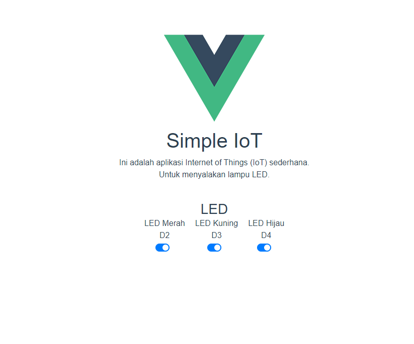

# WeMos IoT Traffic Light

Untuk installasi, silakan pasang install dulu Servernya.

```
cd Server
cd backend && npm install

cd ..
cd frontend && npm install
```

Jangan lupa import juga file SQL yang sudah disediakan.
Setelah itu edit juga `your-api-url` yang ada di frontend dan file .ino dengan alamat server ataua alamat ip dari backendnya.

Untuk skema, saya tidak punya board WeMos D1 R2 v2 nya, sehingga saya pakai board Arduino Uno.
Untuk pengaturan PIN, mirip seperti skema, untuk pin 2 maka ada di D2, pin 3 ada di D3, begitu juga seterusnya.

PIN pada file .ino juga sedikit berbeda, ini mengacu pada list berikut :

```
D0   = 16;
D1   = 5;
D2   = 4;
D3   = 0;
D4   = 2;
D5   = 14;
D6   = 12;
D7   = 13;
D8   = 15;
RX   = 3;
TX   = 1;
```


